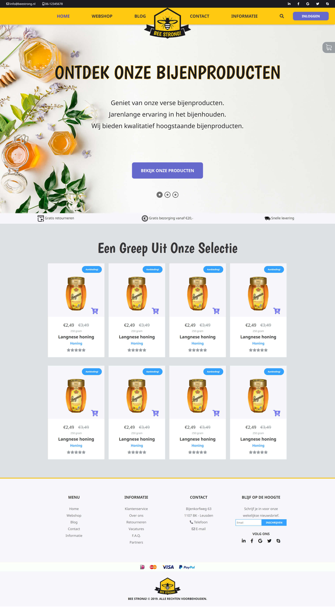

# College of Multimedia opdracht MM-A-2

## Opdrachtomschrijving MM-A deel 2

> Produceer de website die je met jouw conceptboek hebt gepresenteerd. Je hoeft niet te wachten met de productie van de website totdat het conceptboek af is. Je mag meteen beginnen met bijvoorbeeld het verzamelen van teksten en afueeldingen. Je mag afwijken van je conceptboek. Je hebt in de tussentijd inmiddels veel nieuwe dingen geleerd. Je wil deze kennis toepassen om het eindproduct nog beter te maken.

## Opmerkingen
* Voor deze opdracht was responsive web design, door middel van media queries, niet vereist.
* Het design van deze opdracht heb ik zelf ontworpen. Eigen kleuren, eigen fonts, etc. en deze daarna naar code omgezet.
* De website is gebouwd met HTML 5, CSS 3 en JavaScript.

[Bekijk de live demo](https://cmm-web-design-module-1-mm-a-2.netlify.app)

